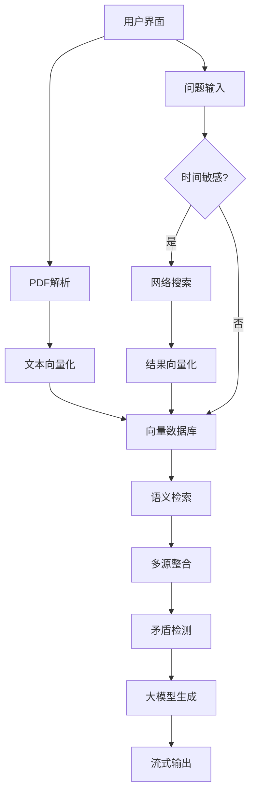

# 本地RAG问答系统

🚀 基于本地大模型的智能文档问答系统，支持PDF文档解析与自然语言问答，🎯新增联网搜索增强能力

## 为什么选择本地RAG？

🔒 **私有数据安全**：全程本地处理，敏感文档无需上传第三方服务

⚡ **实时响应**：基于本地向量数据库实现毫秒级语义检索

💡 **领域适配**：可针对专业领域文档定制知识库

🌐 **离线/在线双模式**：🎯支持本地文档与网络结果智能融合

💰 **成本可控**：避免云服务按次计费，长期使用成本更低

## 功能特性

📄 PDF文档解析与向量化存储

🧠 基于DeepSeek-7B本地大模型

⚡ 流式回答生成

🔍 语义检索与上下文理解

🎯🌐 联网搜索增强（SerpAPI集成）

🎯🔗 多源结果智能整合与矛盾检测

🖥️ 友好的Web交互界面

## 快速开始

### 环境要求

- Python 3.9+
- 内存：至少8GB
- 显存：至少4GB（推荐8GB）
- 🎯 SerpAPI账号（免费额度可用，100次/月）

### 安装步骤

1. 克隆仓库：
```bash
git clone https://github.com/weiwill88/Local_Pdf_Chat_RAG
cd Local_Pdf_Chat_RAG
```

2. 创建虚拟环境：
```bash
python -m venv rag_env
source rag_env/bin/activate  # Linux/Mac
rag_env\Scripts\activate  # Windows
```

3. 安装依赖：
```bash
pip install -r requirements.txt
```

4. 配置环境变量：
```bash
# 复制示例文件
cp .env.example .env
# 编辑.env文件添加你的API密钥
SERPAPI_KEY=your_serpapi_key_here
```

5. 安装Ollama服务：
```bash
curl -fsSL https://ollama.com/install.sh | sh  # Linux/Mac
winget install ollama  # Windows（需要管理员权限）

ollama pull deepseek-r1:7b
```

# 启动Ollama服务（Windows会自动注册服务）
```bash
ollama serve &
```

### 使用方法

1. 启动服务：
```bash
.\rag_env\Scripts\activate
python rag_demo.py
```
2. 访问浏览器打开的本地地址（通常是`http://localhost:17995`）

3. 操作流程：
   - 上传PDF文档（等待处理完成）
   - 在提问区输入问题（🎯时间敏感问题自动获取最新网络结果）
   - 查看整合本地文档与网络搜索的智能回答

### 界面预览


## 配置说明

1. 模型配置：
   - 修改`rag_demo.py`中第147行的模型名称：
   ```python
   "model": "deepseek-r1:7b"  # 可替换为其他支持的模型
   ```

2. 性能调优：
   - 调整`process_pdf`函数中的文本分割参数：
   ```python
   chunk_size=800  # 文本块大小
   chunk_overlap=50  # 块间重叠
   ```

3. 网络搜索设置：
```python
# 在combined_rag.py中调整搜索参数
SEARCH_ENGINE = "google"  # 可选：bing, duckduckgo
NUM_RESULTS = 5           # 默认获取5条网络结果
```

4. 结果排序策略：
```python
# 在combined_query_answer函数中调整排序逻辑
sorted_items = sorted(
    combined_items,
    key=lambda x: (x["type"] != "web", -len(x["excerpt"]))
)
```

## 技术架构


## RAG优化技巧

🛠️ **分块策略优化**：
  - 根据文档类型调整chunk_size（技术文档建议800-1200，对话文本建议400-600）
  - 使用滑动窗口重叠策略保持上下文连贯性

🔍 **检索增强**：
  - 结合BM25+语义检索的混合搜索
  - 添加文档元数据过滤（如章节标题）
  - 实现结果重排序（Rerank）提升相关性

💬 **查询优化**：
  - 问题重写（Query Rewriting）
  - 查询扩展（Query Expansion）
  - 多轮对话上下文管理

⚡ **性能优化**：
  - 使用量化版嵌入模型（如all-MiniLM-L6-v2）
  - 实现向量索引缓存机制
  - 采用批处理加速文档处理

📊 **评估体系**：
  - 构建测试用例评估召回率
  - 监控回答准确率
  - 记录用户反馈持续优化

## 常见问题

Q: Ollama必须用Docker安装吗？

A: 不需要！Ollama提供原生安装方式：
   - Linux/Mac: 直接运行安装脚本
   - Windows: 通过winget安装
   - 详细安装指南：https://ollama.com/download

Q: 模型文件存储在哪里？

A: 默认存储路径：
   - Windows: C:\Users\<用户名>\.ollama
   - Linux: ~/.ollama
   - Mac: ~/.ollama

Q: 如何管理本地模型？

A: 常用命令：
   - 查看已安装模型：ollama list
   - 删除模型：ollama rm <模型名>
   - 更新模型：ollama pull <模型名>

Q: 处理大文件时内存不足怎么办？

A: 尝试减小chunk_size参数值（建议不低于400）

Q: 如何更换其他模型？

A: 1. 使用`ollama pull <model-name>`下载新模型
   2. 修改代码中的模型名称参数
   3. 重启服务

Q: 如何获取SerpAPI密钥？

A: 1. 访问https://serpapi.com/ 注册账号
   2. 在Dashboard获取API密钥
   3. 填入项目的.env文件

Q: 网络搜索结果如何与本地文档结合？

A: 系统自动执行以下流程：
   1. 时间敏感问题触发网络搜索
   2. 结果向量化后存入同一数据库
   3. 检索时综合本地与网络结果
   4. 生成回答时标注数据来源

Q: 如何禁用网络搜索功能？

A: 在combined_rag.py中设置：
```python
# 改为False完全禁用网络功能
SEARCH_ENABLED = True
# 或保留功能但设置默认不搜索
time_sensitive = False
```

## 许可证
MIT License
