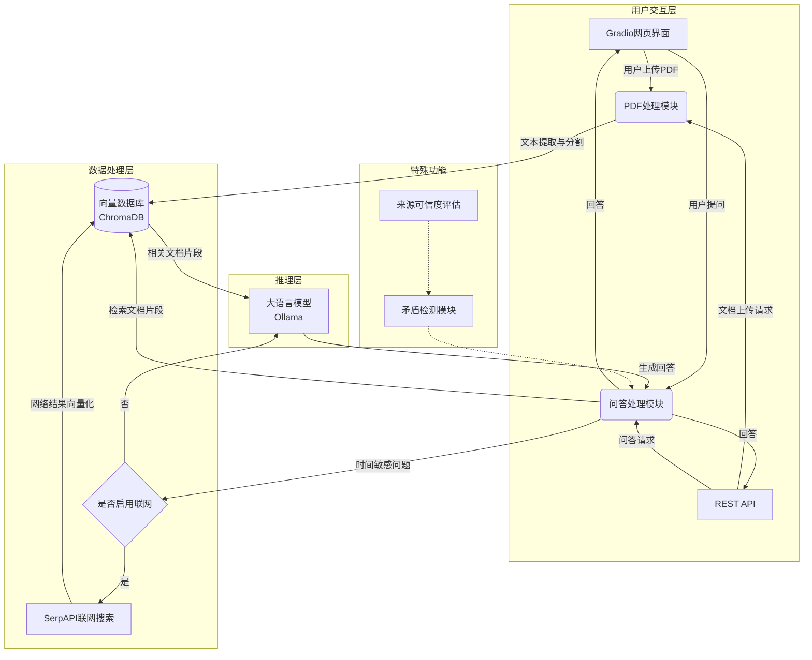
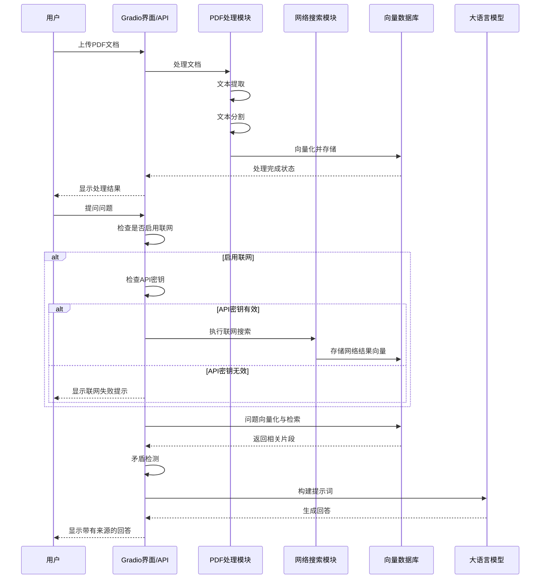
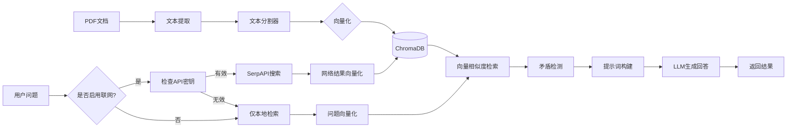

<div align="center">
<h1>📚 本地化智能问答系统</h1>
<p>


</p>
</div>

## 📋 目录

- [📑 项目概述](#-项目概述)
- [🌟 核心功能](#-核心功能)
- [🔧 系统架构](#-系统架构)
- [🚀 使用方法](#-使用方法)
- [📦 依赖项](#-依赖项)
- [🔄 系统流程](#-系统流程)
- [📝 许可证](#-许可证)

## 📑 项目概述

本项目是一个基于RAG（检索增强生成）技术的本地化智能问答系统，支持PDF文档处理和网络搜索，能够回答基于上传文档内容的问题，以及融合最新网络信息的查询。

系统使用本地大语言模型进行推理，确保数据安全的同时提供高质量的问答服务。

## 🌟 核心功能

- 📁 **PDF文档处理**：上传并处理多个PDF文档，自动分割和向量化
- 🔍 **智能问答**：基于本地文档的精准问答能力
- 🌐 **联网搜索增强**：选择性启用网络搜索，获取最新信息（需配置API密钥）
- ⚖️ **矛盾检测**：自动识别文档与网络信息间的矛盾并标注
- 🚀 **双重访问方式**：Gradio网页界面 + RESTful API接口
- 🔒 **本地部署**：数据不离开本地，保障信息安全

## 🔧 系统架构



### 🔦 功能特点

- 📄 **文档处理**：自动分割长文档，转换为向量表示并存储
- 🧠 **语义理解**：通过向量相似度检索相关文本片段
- 🤖 **自适应模型**：支持多种Ollama模型，默认使用deepseek-r1系列
- ⏱️ **时间敏感性检测**：自动识别需要最新信息的问题
- 🔄 **矛盾处理**：当本地文档与网络信息冲突时，提供多来源对比
- 🎨 **主题自适应界面**：支持亮色/暗色模式

## 🚀 使用方法

### 环境准备

1. **安装依赖项**：

```bash
pip install -r requirements.txt
```

2. **安装并启动Ollama服务**：
```bash
# 安装Ollama (根据系统访问 https://ollama.com/download)
# 启动服务
ollama serve
# 拉取模型(根据电脑配置自行选择)
ollama pull deepseek-r1:1.5b
ollama pull deepseek-r1:7b
ollama pull deepseek-r1:14b
```

3. **（可选）配置联网搜索**：
在项目根目录创建.env文件，添加：
```
SERPAPI_KEY=您的SERPAPI密钥
```

可在SerpAPI官网免费注册获取密钥。

### 启动服务

1. **启动Gradio网页界面**：
```bash
python rag_demo.py
```

2. **启动API服务**（如果需要把服务接入其他应用时才需要）：
```bash
python api_router.py
```

### 使用方式

#### 网页界面
- 访问自动打开的本地URL（通常为http://localhost:17995）
- 上传PDF文档，点击"开始处理"
- 在问题输入框中提问，可选择是否启用联网搜索
- 点击"开始提问"获取回答

#### API接口
- API文档自动生成并可在http://localhost:17995/docs访问。
- 主要接口：
  - `POST /api/upload`：上传PDF文档
  - `POST /api/ask`：提交问题（支持联网搜索选项）
  - `GET /api/status`：检查系统状态
  - `GET /api/web_search_status`：检查联网功能状态

## 📦 依赖项

详见requirements.txt文件，核心依赖包括：
- gradio：构建交互界面
- sentence-transformers：文本向量化
- chromadb：向量数据库
- pdfminer.six：PDF文本提取
- langchain：文本分割
- fastapi & uvicorn：API服务

## 🔄 系统流程

### 内部系统流程



### 数据流转图



## 🔬 RAG系统实现细节与改进方向

本系统的RAG实现包含以下几个关键组件的具体实现细节、当前局限性和可能的改进方向。这些信息可以帮助开发者了解系统的工作原理并进行针对性优化。

### 1. 分块策略

**当前实现**：
```python
text_splitter = RecursiveCharacterTextSplitter(
    chunk_size=800,
    chunk_overlap=50
)
chunks = text_splitter.split_text(text)
```

**局限性**：
- 使用固定大小的文本分块，未考虑文本的语义完整性
- 简单的字符数量限制可能导致中断句子、段落或语义单元
- 重叠区域较小，可能影响上下文连贯性
- 未针对中文文本特性进行优化

**改进方向**：
- 使用语义感知的分块策略，考虑自然段落和句子边界
- 增加块重叠区域，提高上下文连贯性
- 针对中文内容，使用段落、标点符号等作为分隔符
- 实现动态分块大小，根据内容复杂度自适应调整
- 可考虑如下实现：
  ```python
  text_splitter = RecursiveCharacterTextSplitter(
      chunk_size=1200,
      chunk_overlap=150,
      separators=["\n\n", "\n", "。", "！", "？", "；", "，", " ", ""]
  )
  ```

### 2. 向量化方法

**当前实现**：
```python
EMBED_MODEL = SentenceTransformer('all-MiniLM-L6-v2')
embeddings = EMBED_MODEL.encode(chunks)
```

**局限性**：
- 使用通用的英文预训练模型，对中文支持有限
- 未对中文文本进行预处理
- 固定的嵌入维度(384)，在某些复杂文档场景下可能信息损失
- 没有针对领域特定文档进行微调

**改进方向**：
- 使用专为中文优化的嵌入模型，如`paraphrase-multilingual-MiniLM-L12-v2`
- 添加中文分词预处理步骤提高向量质量
- 对特定领域文档微调嵌入模型
- 实现句子级和文档级双重嵌入，提高检索精度
- 示例改进实现：
  ```python
  # 添加中文分词预处理
  def preprocess_chinese(text):
      return " ".join(jieba.cut(text))
  
  # 使用中文优化模型
  EMBED_MODEL = SentenceTransformer('paraphrase-multilingual-MiniLM-L12-v2')
  processed_chunks = [preprocess_chinese(chunk) for chunk in chunks]
  embeddings = EMBED_MODEL.encode(processed_chunks)
  ```

### 3. 检索策略

**当前实现**：
```python
results = COLLECTION.query(
    query_embeddings=query_embedding,
    n_results=5,
    include=['documents', 'metadatas']
)
```

**局限性**：
- 仅使用向量相似度检索，未考虑词频等其他信号
- 固定返回结果数量，不考虑实际相关性
- 没有相关性阈值筛选，可能返回不相关内容
- 未利用问题类型进行检索策略调整

**改进方向**：
- 实现混合检索策略，结合向量检索和关键词检索(BM25)
- 动态调整返回结果数量，基于相似度阈值
- 添加相关性打分和筛选机制
- 根据问题类型选择不同检索策略
- 示例混合检索实现：
  ```python
  # 混合检索函数
  def hybrid_search(question, n_results=10, semantic_weight=0.7):
      # 向量检索
      query_embedding = EMBED_MODEL.encode([question]).tolist()
      semantic_results = COLLECTION.query(
          query_embeddings=query_embedding,
          n_results=n_results,
          include=['documents', 'metadatas', 'distances']
      )
      
      # BM25检索
      bm25_results = search_with_bm25(question, top_k=n_results)
      
      # 结合两种结果
      # ...合并逻辑...
      
      return combined_results
  ```

### 4. 重排策略

**当前实现**：
- 当前版本未实现专门的重排序机制
- 仅依赖初始检索结果的相似度排序

**局限性**：
- 无法区分高质量和低质量的检索结果
- 没有考虑文本的多样性，可能出现内容重复
- 未针对实际问答相关性进行重排
- 缺乏上下文关联性评估

**改进方向**：
- 实现最大边际相关性(MMR)重排序，平衡相关性和多样性
- 添加基于交叉编码器的精细重排，进一步提高相关性评估准确度
- 考虑文档来源的可信度和时效性进行重排
- 添加基于注意力权重的上下文关联性分析
- 示例MMR重排序实现：
  ```python
  def mmr_rerank(query_embedding, candidate_embeddings, candidates_data, lambda_param=0.6, k=5):
      """最大边际相关性算法，平衡相关性和多样性"""
      # ...MMR实现逻辑...
      return reranked_indices
  ```

通过以上改进，可以显著提升RAG系统的性能和用户体验。开发者可以根据自己的应用场景和需求，选择性地实现这些优化措施。

这个系统采用了最新的RAG架构，可以根据用户偏好灵活切换联网搜索能力，同时保持对本地文档的高质量理解。无论是通过直观的网页界面还是功能完备的API接口，都能满足不同场景下的文档问答需求。

## 许可证

本项目采用MIT许可证。