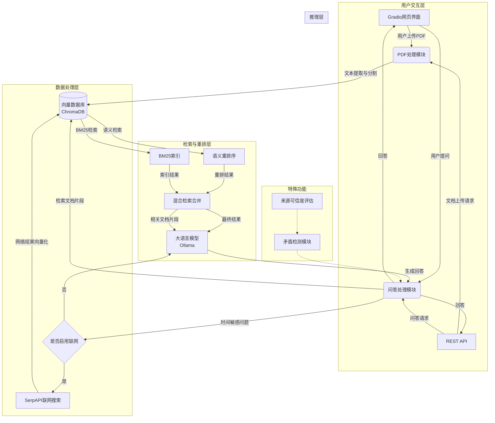
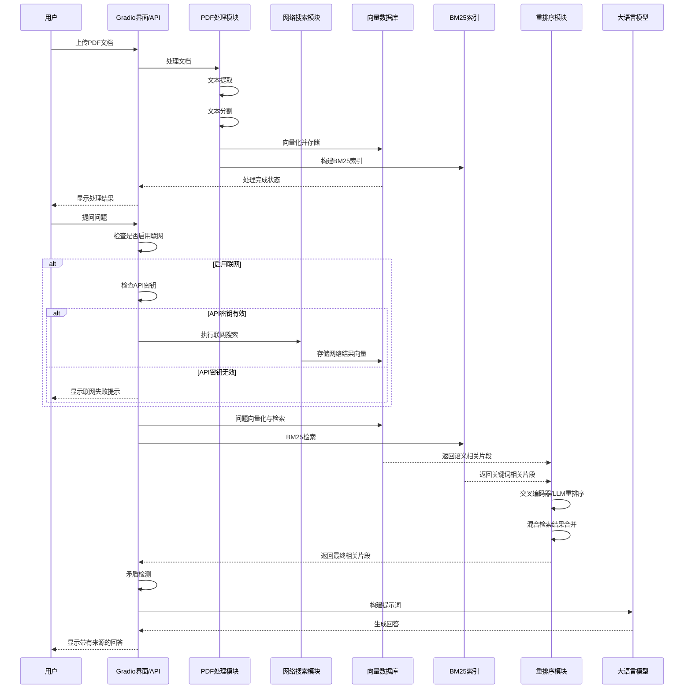
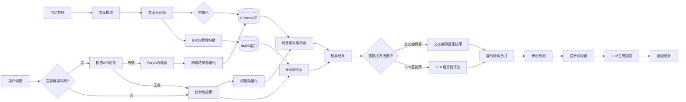
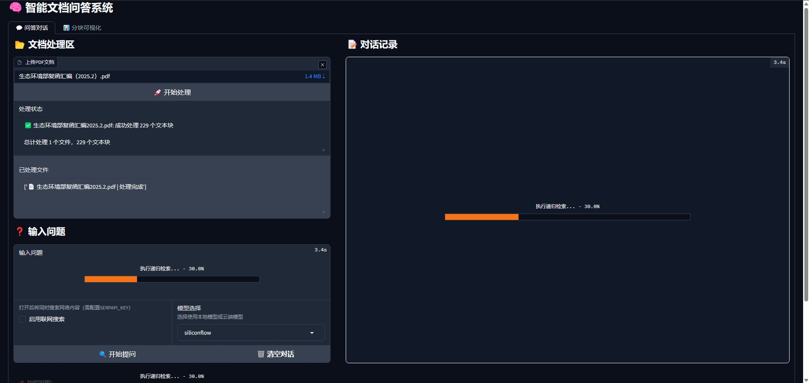
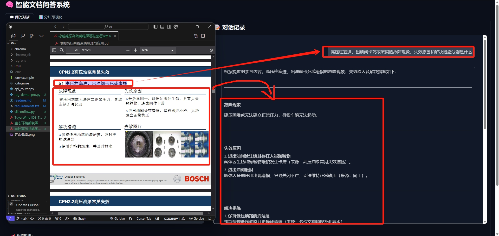
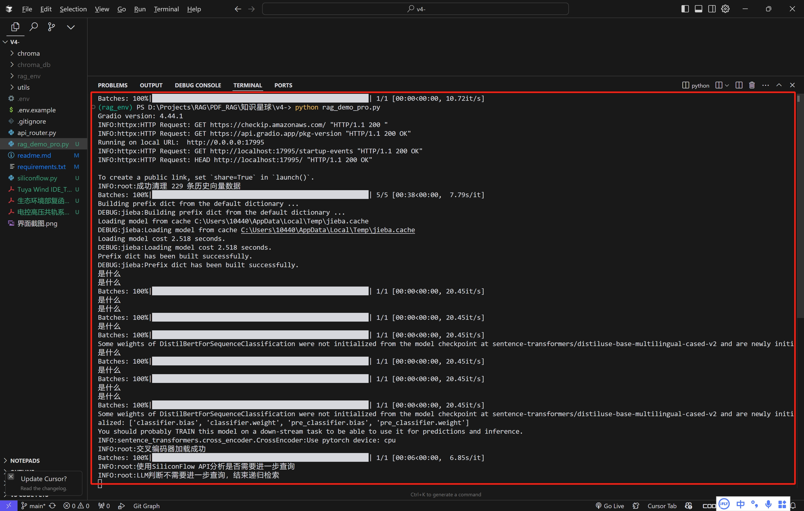
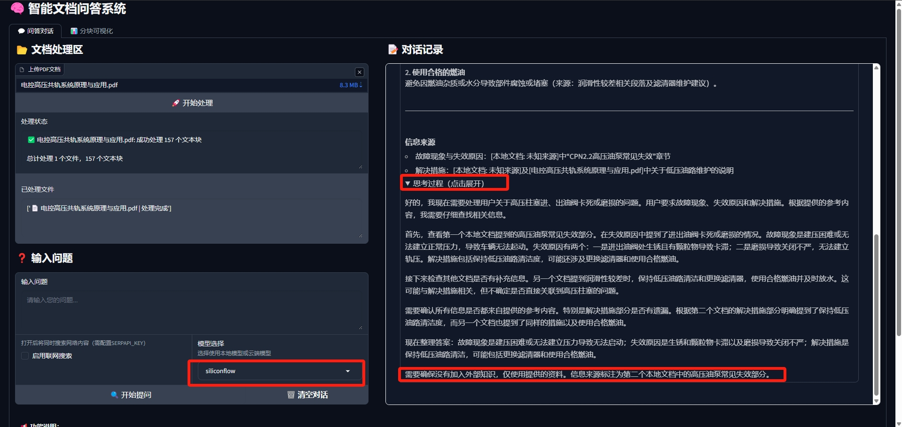

<div align="center">
<h1>📚 本地化智能问答系统</h1>
<p>


</p>
</div>

## 📋 目录

- [📑 项目概述](#-项目概述)
- [🌟 核心功能](#-核心功能)
- [🔧 系统架构](#-系统架构)
- [🚀 使用方法](#-使用方法)
- [📦 依赖项](#-依赖项)
- [🔄 系统流程](#-系统流程)
- [🚀 高级功能](#-高级功能)
- [📝 许可证](#-许可证)

## 📑 项目概述

本项目是一个基于RAG（检索增强生成）技术的本地化智能问答系统，支持PDF文档处理和网络搜索，能够回答基于上传文档内容的问题，以及融合最新网络信息的查询。

系统使用本地大语言模型进行推理，确保数据安全的同时提供高质量的问答服务。

## 🌟 核心功能

- 📁 **PDF文档处理**：上传并处理多个PDF文档，自动分割和向量化
- 🔍 **智能问答**：基于本地文档的精准问答能力
- 🌐 **联网搜索增强**：选择性启用网络搜索，获取最新信息（需配置API密钥）
- ⚖️ **矛盾检测**：自动识别文档与网络信息间的矛盾并标注
- 🔄 **混合检索**：结合语义检索和BM25检索，提高检索准确性
- 📊 **结果重排序**：支持交叉编码器和LLM重排序，优化相关性排序
- 🚀 **双重访问方式**：Gradio网页界面 + RESTful API接口
- 🔒 **本地部署**：数据不离开本地，保障信息安全

## 🔧 系统架构



### 🔦 功能特点

- 📄 **文档处理**：自动分割长文档，转换为向量表示并存储
- 🧠 **语义理解**：通过向量相似度检索相关文本片段
- 🔎 **BM25检索**：结合传统词频检索，提高召回率
- 🤖 **多模型支持**：支持本地Ollama模型以及SiliconFlow云端模型，可动态切换
- 🧠 **思维链展示**：显示模型思考过程，帮助理解回答生成逻辑
- 🎨 **主题自适应界面**：支持亮色/暗色模式

## 🚀 使用方法

### 环境准备

1. **创建并激活虚拟环境**：

```bash
# 使用venv创建虚拟环境（推荐）
python -m venv rag_env
# 激活虚拟环境
# Windows
rag_env\Scripts\activate
# Linux/macOS
source rag_env/bin/activate

# 或者使用conda创建虚拟环境
conda create -n rag_env python=3.9
conda activate rag_env
```

2. **安装依赖项**：

```bash
pip install -r requirements.txt
```

3. **安装并启动Ollama服务**：
```bash
# 安装Ollama (根据系统访问 https://ollama.com/download)
# 启动服务
ollama serve
# 拉取模型(根据电脑配置自行选择)
ollama pull deepseek-r1:1.5b
ollama pull deepseek-r1:7b等
```

4. **（可选）配置联网搜索**：
在项目根目录创建.env文件，添加：
```
SERPAPI_KEY=您的SERPAPI密钥
```

5. **（可选）配置SiliconFlow API**：
在.env文件中添加SiliconFlow API密钥以启用云端模型支持：
```
SILICONFLOW_API_KEY=您的SiliconFlow API密钥
```
SiliconFlow提供更强大的云端模型，可作为本地模型的备选方案，特别适合处理复杂问题或本地算力有限的情况。

### 启动服务

1. **启动Gradio网页界面**：
```bash
python rag_demo_pro.py
```
系统会自动检查环境，确认Ollama服务是否正常运行，并尝试在可用端口(17995-17999)启动服务。

2. **启动API服务**（如果需要把服务接入其他应用时才需要）：
```bash
python api_router.py
```
注意：当前版本中API服务需要单独下载`api_router.py`文件，该文件不包含在基础代码包中。

### 使用方式

#### 网页界面
- 服务启动后会自动打开浏览器访问本地URL（通常为http://localhost:17995）
- 上传PDF文档，点击"开始处理"
- 在问题输入框中提问，可选择是否启用联网搜索
- 从模型选择下拉菜单中选择使用本地Ollama模型或云端SiliconFlow模型
- 点击"开始提问"获取回答
- 思考过程会在回答下方以可折叠方式显示，点击即可查看模型思考链

#### API接口
- API文档自动生成并可在http://localhost:17995/docs访问。
- 主要接口：
  - `POST /api/upload`：上传PDF文档
  - `POST /api/ask`：提交问题（支持联网搜索选项）
  - `GET /api/status`：检查系统状态
  - `GET /api/web_search_status`：检查联网功能状态

## 📦 依赖项

详见requirements.txt文件，核心依赖包括：
- gradio：构建交互界面
- sentence-transformers：文本向量化
- chromadb：向量数据库
- pdfminer.six：PDF文本提取
- langchain：文本分割
- fastapi & uvicorn：API服务
- python-dotenv：环境变量管理
- requests & urllib3：网络请求处理
- jieba：中文分词（用于改进向量化）
- rank_bm25：实现BM25检索算法

## 🔄 系统流程

### 内部系统流程



### 数据流转图



## 🚀 高级功能

系统实现了多种高级RAG功能，提高问答质量和准确性：

### 1. BM25检索

使用经典的BM25算法进行关键词检索，与向量检索互补，提高召回率：

```python
class BM25IndexManager:
    def build_index(self, documents, doc_ids):
        # 构建BM25索引
        
    def search(self, query, top_k=5):
        # 基于BM25算法检索相关文档
```

### 2. 重排序策略

提供两种重排序方法优化检索结果的相关性：

- **交叉编码器重排序**：使用交叉编码器模型评估查询与文档片段的相关性
```python
def rerank_with_cross_encoder(query, docs, doc_ids, metadata_list, top_k=5):
    # 使用交叉编码器进行重排序
```

- **LLM重排序**：利用大语言模型为每个文档片段打分
```python
def rerank_with_llm(query, docs, doc_ids, metadata_list, top_k=5):
    # 使用LLM进行重排序
```

### 3. 混合检索合并

将不同来源的检索结果智能合并，平衡各种检索策略的优势：

```python
def hybrid_merge(semantic_results, bm25_results, alpha=0.7):
    # 合并语义检索和BM25检索结果
```

### 4. 文档块查看与管理

提供文档块详细信息查看功能，帮助理解检索结果：

```python
def get_document_chunks(progress=gr.Progress()):
    # 获取所有文档块
    
def show_chunk_details(evt: gr.SelectData, chunks):
    # 显示文档块详细信息
```

### 5. 递归检索与迭代查询

实现迭代式深度检索，通过分析当前结果自动生成后续查询：

```python
def recursive_retrieval(initial_query, max_iterations=3, enable_web_search=False, model_choice="ollama"):
    # 迭代检索，深入探索问题的多个方面
```

系统会自动分析初次检索结果，判断是否需要进一步查询，并根据判断生成新的查询问题，最多迭代3次。这种方式能更全面地处理复杂问题，获取更深入的信息。

### 6. 多模型支持

系统支持两种模型选择，适应不同应用场景：

- **本地Ollama模型**：默认选项，不需要联网，保护数据安全
- **SiliconFlow云端模型**：当处理复杂问题或需要更高质量回答时的备选方案

```python
def call_siliconflow_api(prompt, temperature=0.7, max_tokens=1024):
    # 调用SiliconFlow云端API获取高质量回答
```

用户可以根据问题复杂度和本地算力情况，灵活切换模型。

## 🖼️ 系统演示

以下是系统的实际运行效果展示：

<div align="center">
  <div style="display: flex; flex-wrap: wrap; justify-content: center; gap: 20px; margin-bottom: 20px;">
    <div style="flex: 1; min-width: 300px; max-width: 500px;">
      
      <p>图1: 文档上传与处理界面</p>
    </div>
    <div style="flex: 1; min-width: 300px; max-width: 500px;">
      
      <p>图2: 问答对话演示</p>
    </div>
  </div>
  
  <div style="display: flex; flex-wrap: wrap; justify-content: center; gap: 20px;">
    <div style="flex: 1; min-width: 300px; max-width: 500px;">
      
      <p>图3: 终端显示日志</p>
    </div>
    <div style="flex: 1; min-width: 300px; max-width: 500px;">
      
      <p>图4: 思维链展示功能</p>
    </div>
  </div>
</div>

## 📞 联系与支持

如果您对本项目有任何疑问或建议，欢迎通过以下方式联系我：

<div align="center" style="display: flex; justify-content: space-around; flex-wrap: wrap; gap: 20px; margin-top: 30px;">
  <div style="text-align: center; margin: 10px;">
    
    <p>公众号: 韦东东</p>
  </div>
  
  <div style="text-align: center; margin: 10px;">
    
    <p>小红书: 韦东东</p>
  </div>
  
  <div style="text-align: center; margin: 10px;">
    
    <p>知识星球: 企业RAG从入门到落地</p>
  </div>
</div>

## 🚀 进阶计划 - 知识星球专属内容

在知识星球【RAG高级开发】中，我将提供本开源项目的进阶版本和专业支持：

### 高级功能迭代

- 🔥 **多模态RAG**：支持图片、表格和混合文档的智能问答
- 🧠 **Agent框架集成**：将RAG与Agent框架结合，实现更复杂的任务自动化
- 🔄 **自适应检索策略**：根据问题类型自动调整检索参数和策略
- 📊 **企业级数据连接器**：连接数据库、API和其他企业数据源
- 🛠 **插件系统**：可扩展的插件架构，支持自定义功能模块

### 实战案例精讲

- 📈 **机械加工维保知识库**：设备手册及维修记录等问答实现
- 📑 **法律文档顾问**：合同审核与法律咨询助手实现等


按需加入！

## 许可证

本项目采用MIT许可证。


